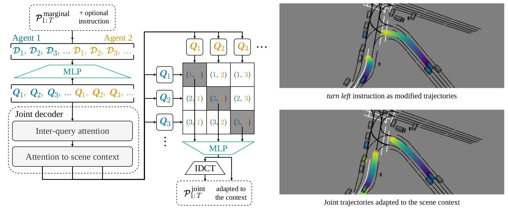
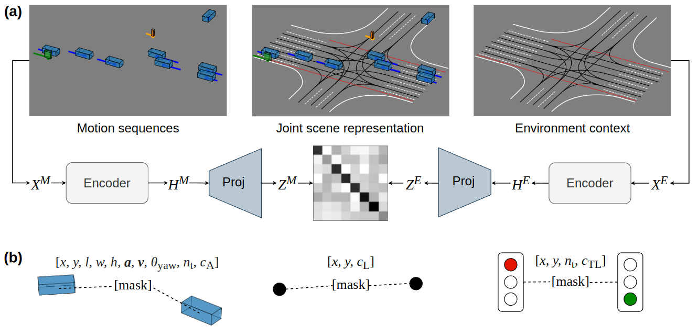

# FutureMotion
  

Common repo for our ongoing research on motion forecasting in self-driving vehicles.

## Table of contents
- [Setup](#setup)
- [Our methods](#our-methods)
  * [RedMotion](#redmotion-motion-prediction-via-redundancy-reduction)
  * [Words in Motion](#words-in-motion-extracting-interpretable-control-vectors-for-motion-transformers)
  * [SceneMotion](#scenemotion-from-agent-centric-embeddings-to-scene-wide-forecasts)
  * [JointMotion](#jointmotion-joint-self-supervision-for-joint-motion-prediction)
- [Other methods](#other-methods)
  * [Wayformer](#wayformer-motion-forecasting-via-simple--efficient-attention-networks)

## Setup
1. Create a new workspace folder, e.g.
```bash
mkdir motion_forecasting_ws
cd motion_forecasting_ws
```
2. Clone this repository and our adapted version of `HPTR`:
```bash
git clone git@github.com:KIT-MRT/future-motion.git
git clone git@github.com:KIT-MRT/hptr.git
```
3. Create a conda environment named `future-motion` with:
```bash
conda env create -f future-motion/conda_env.yml
conda activate future-motion
```
4. Install `future-motion` and `hptr` as editable packages:
```bash
pip install -e future-motion
pip install -e hptr
```

Prepare Waymo Open Motion and Argoverse 2 Forecasting datasets by following the instructions in the [HPTR repository](https://github.com/zhejz/HPTR).

## Our methods

### RetroMotion: Retrocausal Motion Forecasting Models are Instructable



**From marginal to joint trajectories.** We use an MLP to generate query matrices $Q$ from marginal trajectories $\mathcal{P}^{\text{marginal}}_{1:T}$ and exchange information between queries and scene context with attention mechanisms Afterwards, we decode joint trajectories $\mathcal{P}^{\text{joint}}_{1:T}$ from pairs of queries at the same index. This compresses information from all $K^2$ possible combinations into $K$ query pairs.Furthermore, this includes a retrocausal flow of information from later points in marginal trajectories to earlier points in joint trajectories. Notably, this enables us to issue intructions by modifying marginal trajectories [(Wagner et al. 2025)](http://arxiv.org/abs/2505.20414).

<details>
<summary><big><b>More details</b></big></summary>

The model definition is in `future_motion/models/ac_retro_motion.py`. The base config for the Waymo Open dataset is in `future_motion/configs/model/ac_retro_motion.yaml`. For our SMoE model, the ped expert is trained using the base config. For the veh expert change `model.motion_decoder.n_pred: 18`, `post_processing.waymo.topk_after_mpa_nms: True` and `post_processing.waymo.topk_aggregate_conf: True`. For the cyc expert change `train_metric.w_pos: [1, 1, 10]`, `train_metric.w_conf: [1, 1, 10]` and `loss_weight_dbl_decoding: 2`.

After training, download the best checkpoints from wandb and adapt the paths in `future_motion/configs/models/expert_models.yaml` to test the SMoE model.

To issue a turn right instruction pass `edit_pred_0=True` to the forward method of RetroMotion. More types of instructions will be released soon.

</details>

### Words in Motion: Extracting Interpretable Control Vectors for Motion Transformers


**Words in Motion.** (a) We classify motion features in an interpretable way, as in natural language. (b) We measure the degree to which these interpretable features are embedded in the hidden states $H_{i,:}$ of transformer models with linear probes. Furthermore, we use our discrete features and sparse autoencoding to fit interpretable control vectors $V_{i,:}$ that allow for modifying motion forecasts at inference. The training of the sparse autoencoder is shown with red arrows ($\textcolor{#f1615c}{\rightarrow}$) and the fitting of control vectors with blue arrows ($\textcolor{#5eb8e7}{\rightarrow}$).

<details>
<summary><big><b>More details</b></big></summary>


<big><b>Contributions</b></big>

* We argue that, to fit control vectors, latent space regularities with separable features are necessary. We use linear probing and show that neural collapse toward interpretable features occurs in
hidden states of recent motion transformers, indicating a structured latent space.
* We fit control vectors using hidden states with opposing features. By modifying hidden states
at inference, we show that control vectors describe functionally important directions. Similar
to the vector arithmetic in _word2vec_, we obtain predictions consistent with the current driving
environment.
* We use sparse autoencoders to optimize our control vectors. Notably, enforcing sparsity leads to
more linear changes in predictions when scaling control vectors. We use linearity measures to
compare these results against a Koopman autoencoder and evaluate the effects of various layers
and activation functions, including convolutional and MLPMixer layers.


<big><b>Gradio demos</b></big>

Use [this Colab notebook](https://colab.research.google.com/drive/1ItY9YWQAmpfwc8KTRp6oY9e4uUWKxZrX?usp=sharing) to start Gradio demos for our speed control vectors.

In contrast to the qualitative results in our paper, we show the motion forecasts for the focal agent and 8 other agents in a scene. 
Press the submit button with the default temperature = 0 to visualize the default (non-controlled) forecasts, then change the temperature and resubmit to visualize the changes. 
The example is from the Waymo Open dataset and shows motion forecasts for vehicles and a pedestrian (top center).

For very low control temperatures (e.g, -100), almost all agents are becoming static.
For very high control temperatures (e.g., 85), even the static (shown in grey) agents begin to move, and the pedestrian does not move faster anymore.
We hypothesize that the model has learned a reasonable upper bound for the speed of a pedestrian.


<big><b>Reference</b></big>
```bibtex
@inproceedings{tas2025words,
  title={Words in Motion: Extracting Interpretable Control Vectors for Motion Transformers},
  author={Omer Sahin Tas and Royden Wagner},
  booktitle={International Conference on Learning Representations (ICLR)},
  year={2025}
}
```

</details>

### SceneMotion: From Agent-Centric Embeddings to Scene-Wide Forecasts


Our attention-based motion forecasting model is composed of stacked encoder and decoder modules. 
Variable-sized agent-centric views $V_i$ are reduced to fixed-sized agent-centric embeddings $E_i$ via cross-attention with road environment descriptor (RED) tokens $R_j$. 
Afterwards, we concatenate the agent-centric embeddings with global reference tokens $G_i$ and rearrange them to form a scene-wide embedding. 
Our latent context module then learns global context and our motion decoder transforms learned anchors $A_k$ into scene-wide forecasts.

<details>
<summary><big><b>More details</b></big></summary>

Adapt the paths and accounts in `sbatch/train_scene_motion_juwels.sh` to your setup to train a SceneMotion model on a Juwels-like cluster with a Slurm system and at least 1 node with 4 A100 GPUs.
The training is configured for the Waymo Open Motion dataset.

To train the model for marginal motion forecasting, add `model.interactive_challenge=False` and `model.train_metric.winner_takes_all=hard1` to the srun command in the train script.

<big><b>Reference</b></big>
```bibtex
@inproceedings{wagner2024scenemotion,
  title={SceneMotion: From Agent-Centric Embeddings to Scene-Wide Forecasts},
  author={Wagner, Royden and Tas, {\"O}mer Sahin and Steiner, Marlon and Konstantinidis, Fabian and K{\"o}nigshof, Hendrik and Klemp, Marvin and Fernandez, Carlos and Stiller, Christoph},
  booktitle={International Conference on Intelligent Transportation Systems (ITSC)},
  year={2024}
}
```

</details>

### JointMotion: Joint Self-Supervision for Joint Motion Prediction



JointMotion is a self-supervised pre-training method that improves joint motion prediction.

**(a)** Connecting motion and environments: Our scene-level objective learns joint scene representations via non-contrastive similarity learning of motion sequences $M$ and environment context $E$. 

**(b)** Masked polyline modeling: Our instance-level objective refines learned representations via masked autoencoding of multimodal polyline embeddings (i.e., motion, lane, and traffic light data).

<details>
<summary><big><b>More details</b></big></summary>

Adapt the paths and accounts in `sbatch/pre_train_joint_motion_scene_transformer_juwels.sh` to your setup to pre-train a Scene Transformer model with the JointMotion objective on a Juwels-like cluster with a Slurm system and at least 1 node with 4 A100 GPUs.
The pre-training is configured for the Waymo Open Motion dataset and takes 10h.
The Scene Transformer model is based on the implementation in [HPTR](https://github.com/zhejz/HPTR) and uses their decoder.

<big><b>Reference</b></big>
```bibtex
@inproceedings{wagner2024jointmotion,
  title={JointMotion: Joint Self-Supervision for Joint Motion Prediction},
  author={Wagner, Royden and Tas, Omer Sahin and Klemp, Marvin and Fernandez, Carlos},
  booktitle={Conference on Robot Learning (CoRL)},
  year={2024},
}
```

</details>

### RedMotion: Motion Prediction via Redundancy Reduction 


Our RedMotion model consists of two encoders. The trajectory encoder generates an embedding for the past trajectory of the current agent. The road environment encoder generates sets of local and global road environment embeddings as context. We use two redundancy reduction mechanisms, (a) architecture-induced and (b) self-supervised, to learn rich representations of road environments. All embeddings are fused via cross-attention to yield trajectory proposals per agent.

<details>
<summary><big><b>More details</b></big></summary>

This repo contains the refactored implementation of RedMotion, the original implementation is available [here](https://github.com/kit-mrt/red-motion).

The Waymo Motion Prediction Challenge doesn't allow sharing the weights used in the challenge. However, we provide a [Colab notebook](https://colab.research.google.com/drive/16pwsmOTYdPpbNWf2nm1olXcx1ZmsXHB8) for a model with a shorter prediction horizon (5s vs. 8s) as a demo.

<big><b>Training</b></big>

To train a RedMotion model (tra-dec config) from scratch, adapt the global variables in train.sh according to your setup (Weights & Biases, local paths, batch size and visible GPUs).
The default batch size is set for A6000 GPUs with 48GB VRAM.
Then start the training run with:
```bash
bash train.sh ac_red_motion
```
For reference, this [wandb plot](https://wandb.ai/kit-mrt/red-motion-hptr/reports/waymo_pred-mean_average_precision-24-05-25-17-50-52---Vmlldzo4MDkyMjQ2?accessToken=j7a8pf4wvm9g6gvy95f88h0asdy57few6rw1jvv1qrf9jzuwpnirzv975id3pgxn) shows the validation mAP scores for the epochs 23 - 129 (default config, trained on 4 A6000 GPUs for ~100h).

<big><b>Reference</b></big>
```bibtex
@article{
    wagner2024redmotion,
    title={RedMotion: Motion Prediction via Redundancy Reduction},
    author={Royden Wagner and Omer Sahin Tas and Marvin Klemp and Carlos Fernandez and Christoph Stiller},
    journal={Transactions on Machine Learning Research},
    year={2024},
}
```

</details>

## Other methods

### Wayformer: Motion Forecasting via Simple & Efficient Attention Networks


Wayformer models take multimodal scene data as input, project it into a homogeneous (i.e., same dim) token format, and transform learned seeds (i.e., trajectory anchors) into multimodal distributions of trajectories.

We provide an open-source implementation of the Wayformer model with an early fusion scene encoder and multi-axis latent query attention. Our implementation is a refactored version of the `AgentCentricGlobal` model from the HPTR repo with improved performance (higher mAP scores).

The hyperparameters defined in `configs/model/ac_wayformer.yaml` follow the ones in Table 4 (see [Appendix D in the Wayformer paper](https://arxiv.org/abs/2207.05844)) except the number of decoders is 1 instead of 3.

<details>
<summary><big><b>More details</b></big></summary>

We use the polyline representation of MPA ([Konev, 2022](https://arxiv.org/abs/2206.10041)) as input and the non-maximum supression (NMS) algorithm of MTR ([Shi et. al., 2023](https://arxiv.org/abs/2209.13508)) to generate 6 trajetories from the predicted 64 trajectories.

Adapt the paths and accounts in `sbatch/train_wayformer_juwels.sh` to your setup to train a Wayformer model on a Juwels-like cluster with a Slurm system and at least 2 nodes with 4 A100 GPUs each.
The training is configured for the Waymo Open Motion dataset and takes roughly 24h.


<big><b>Reference</b></big>
```bibtex
@inproceedings{nayakanti2023wayformer,
  title={Wayformer: Motion forecasting via simple \& efficient attention networks},
  author={Nayakanti, Nigamaa and Al-Rfou, Rami and Zhou, Aurick and Goel, Kratarth and Refaat, Khaled S and Sapp, Benjamin},
  booktitle={International Conference on Robotics and Automation (ICRA)},
  year={2023},
}
```

</details>

## Acknowledgements
This repo builds upon the great work [HPTR](https://github.com/zhejz/HPTR) by [@zhejz](https://github.com/zhejz). 
